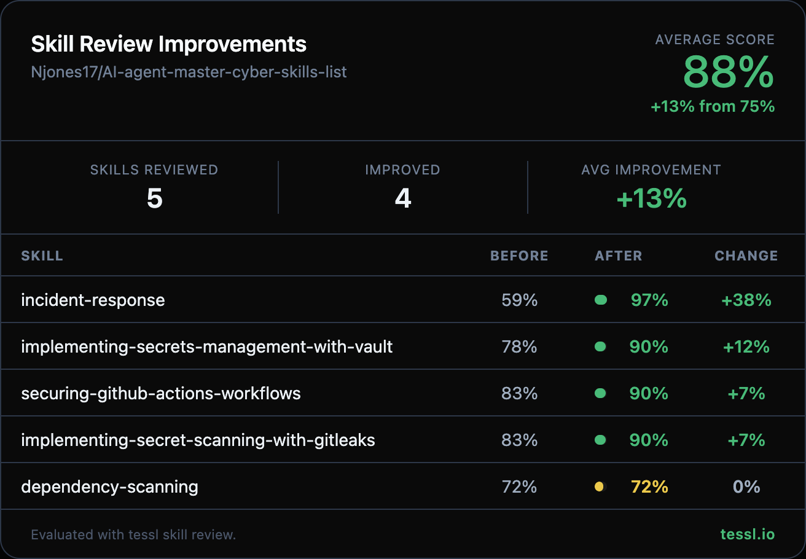

Hey @Njones17 👋

I ran your skills through `tessl skill review` at work and found some targeted improvements. Here's the full before/after:

| Skill | Before | After | Change |
|-------|--------|-------|--------|
| incident-response | 59% | 97% | +38% |
| implementing-secrets-management-with-vault | 78% | 90% | +12% |
| securing-github-actions-workflows | 83% | 90% | +7% |
| implementing-secret-scanning-with-gitleaks | 83% | 90% | +7% |
| dependency-scanning | 72% | 72% | 0% |

I kept this PR focused on the 4 skills with the biggest improvements to keep the diff reviewable (280 lines). `dependency-scanning` already had a perfect description score — its content improvements would've been a large restructuring PR on its own. Happy to follow up with that in a separate PR if you'd like.

What changed

**incident-response** (+38%)
- Rewrote description with richer trigger terms (breach, compromise, ransomware, SOC alert, forensic evidence, tabletop exercises)
- Replaced generic YAML phase listing with a 5-step actionable workflow with concrete bash commands
- Added validation checkpoints between each IR phase (confirm true positive → verify isolation → hash evidence → re-scan after eradication → 24h monitoring window)

**securing-github-actions-workflows** (+7%)
- Converted chevron `>` description to quoted string and added explicit "Use when" clause
- Moved `domain`, `subdomain`, `tags`, `version`, `author` into `metadata` block (fixes unknown frontmatter keys warning)
- Removed generic Prerequisites, Key Concepts table, and Tools & Systems section that Claude already knows

**implementing-secret-scanning-with-gitleaks** (+7%)
- Converted chevron `>` description to quoted string and added explicit "Use when" clause
- Moved non-standard frontmatter keys into `metadata` block
- Removed Key Concepts glossary and Tools & Systems section to improve conciseness

**implementing-secrets-management-with-vault** (+12%)
- Converted chevron `>` description to quoted string and added explicit "Use when" clause
- Moved non-standard frontmatter keys into `metadata` block
- Added validation checkpoints after Steps 1-3 (`vault status` check, auth method test login, dynamic credential verification)
- Removed Key Concepts table and Tools & Systems section

Honest disclosure — I work at @tesslio where we build tooling around skills like these. Not a pitch - just saw room for improvement and wanted to contribute.

Want to self-improve your skills? Just point your agent (Claude Code, Codex, etc.) at [this Tessl guide](https://docs.tessl.io/evaluate/optimize-a-skill-using-best-practices) and ask it to optimize your skill. Ping me - [@yogesh-tessl](https://github.com/yogesh-tessl) - if you hit any snags.

Thanks in advance 🙏
