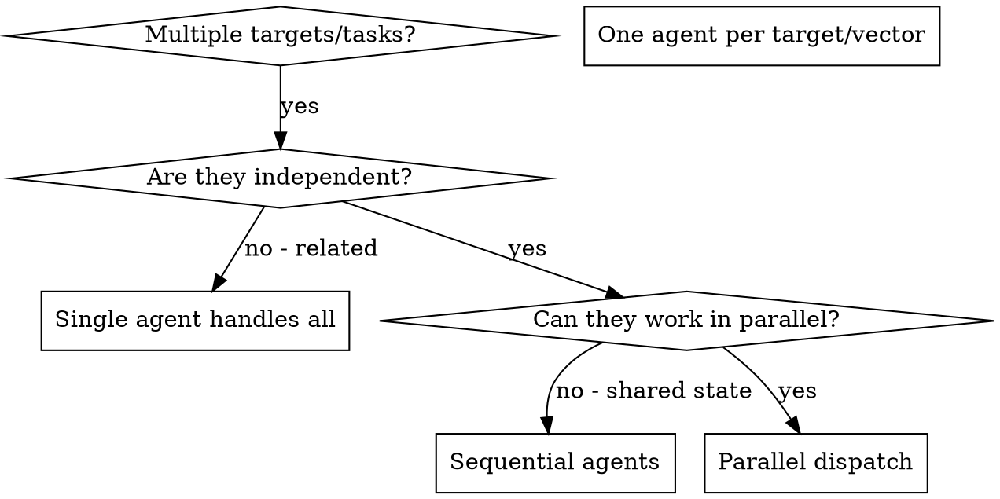

# Dispatching Parallel Agents

## Required Tools

> This is a workflow coordination skill. It requires no external security tools — it orchestrates how the AI dispatches and manages parallel tasks.

## Tool Execution Protocol

**MANDATORY**: All parallel dispatch commands MUST follow this protocol:

1. **Agent dispatch with validation**
   ```bash
   # When dispatching agents, validate each dispatch succeeds
   # Agent tool handles this internally, but verify responses
   ```

2. **Output collection with timeout**
   ```bash
   # Set reasonable timeout for parallel operations
   # Default: 30 minutes for complex scans, 5-10 minutes for focused tests
   ```

3. **Agent failure handling**
   ```bash
   # If an agent fails or times out:
   # 1. Log the failure with agent ID and task description
   # 2. Continue collecting results from other agents
   # 3. Retry failed agent if critical (max 3 attempts)
   # 4. Report partial results if retry fails
   ```

4. **Result validation**
   ```bash
   # When agents return, validate their output:
   # - Check for findings summary
   # - Verify scope compliance
   # - Confirm evidence was collected
   # If output is missing or malformed, request clarification
   ```

## Overview

When you have multiple independent security tasks (different targets, different attack vectors, different findings to investigate), running them sequentially wastes time. Each investigation is independent and can happen in parallel.

**Core principle:** Dispatch one agent per independent problem domain. Let them work concurrently.

## When to Use



**Use when:**
- 3+ independent targets or attack surfaces to test
- Multiple unrelated findings to investigate or verify
- Each task can be understood without context from others
- No shared state between investigations (different hosts, different vuln classes)

**Don't use when:**
- Findings are related (one vuln chains into another)
- Need to understand full network topology first
- Agents would interfere with each other (same target, rate limiting, IDS triggering)

## The Pattern

### 1. Identify Independent Domains

Group tasks by what's being tested:

- Target A: Web application (ports 80/443)
- Target B: API gateway (port 8443)
- Target C: Internal network services (SSH, SMB, RDP)

Each domain is independent — testing the webapp doesn't affect API testing or network service enumeration.

### 2. Create Focused Agent Tasks

Each agent gets:
- **Specific scope:** One target, one attack surface, or one finding to verify
- **Clear goal:** Enumerate and test this specific target
- **Constraints:** Stay within scope, don't touch other targets
- **Expected output:** Summary of findings with evidence

### 3. Dispatch in Parallel

```
# Security engagement with parallel agents
Task("Enumerate and test webapp at 10.10.10.50:443")
Task("Fuzz and test API endpoints at 10.10.10.50:8443")
Task("Scan and enumerate network services on 10.10.10.0/24")
# All three run concurrently
```

### 4. Review and Integrate

When agents return:
- Read each findings summary
- Check for attack chain opportunities across findings
- Verify no scope violations occurred
- Consolidate all findings into unified report

## Agent Prompt Structure

Good agent prompts are:
1. **Focused** — One clear target or attack vector
2. **Self-contained** — All context needed (IP, ports, credentials, scope)
3. **Specific about output** — What evidence and format to return

```markdown
Enumerate and test the web application at https://10.10.10.50:

1. Run directory fuzzing with ffuf against common wordlists
2. Run nuclei with web-specific templates
3. Test for OWASP Top 10 — focus on injection and auth bypass
4. Check for sensitive file exposure (.git, .env, backup files)

Scope constraints:
- Target ONLY 10.10.10.50 ports 80 and 443
- Do NOT attempt DoS or brute-force attacks
- Do NOT pivot to other hosts

Return: List of verified findings with severity, evidence (request/response),
and reproduction steps. Use superhackers:writing-security-reports finding format.
```

## Common Mistakes

**❌ Too broad:** "Test the entire network" — agent gets overwhelmed
**✅ Specific:** "Enumerate services on 10.10.10.0/24 subnet" — focused scope

**❌ No context:** "Find the SQL injection" — agent doesn't know where
**✅ Context:** Provide the target URL, parameter names, and observed behavior

**❌ No constraints:** Agent might scan out of scope or trigger alerts
**✅ Constraints:** "Target ONLY this IP range" or "Do NOT run active exploits"

**❌ Vague output:** "Report what you find" — inconsistent findings format
**✅ Specific:** "Return findings using superhackers:writing-security-reports format with evidence"

## When NOT to Use

**Chained vulnerabilities:** One finding feeds the next — investigate together first
**Shared target rate limiting:** Multiple agents hitting same host triggers WAF/IDS
**Exploratory recon:** You don't know the attack surface yet — enumerate first
**Shared state:** Agents would interfere (same authenticated session, same target host under rate limits)

## Real Example from Engagement

**Scenario:** Full security assessment of a corporate environment with 3 distinct attack surfaces

**Targets discovered during recon:**
- External webapp: https://portal.target.com (Apache/Tomcat)
- REST API: https://api.target.com (Node.js/Express)
- Internal network: 10.10.10.0/24 (Windows AD environment)

**Decision:** Independent domains — webapp testing doesn't affect API testing or internal network assessment

**Dispatch:**
```
Agent 1 → webapp-pentesting on portal.target.com (nuclei + ffuf + manual OWASP testing)
Agent 2 → api-pentesting on api.target.com (endpoint fuzzing + auth bypass + BOLA testing)
Agent 3 → infra-pentesting on 10.10.10.0/24 (nmap + service enumeration + SMB testing)
```

**Results:**
- Agent 1: Found deserialization vuln in Tomcat, directory traversal in upload handler
- Agent 2: Discovered BOLA on /api/users/{id}, JWT secret brute-forceable
- Agent 3: Found SMB signing disabled, AS-REP roastable accounts, default creds on printer

**Integration:** All findings independent, no scope conflicts, consolidated into unified report

**Time saved:** 3 attack surfaces assessed in parallel vs sequentially

## Key Benefits

1. **Parallelization** — Multiple investigations happen simultaneously
2. **Focus** — Each agent has narrow scope, less context to track
3. **Independence** — Agents don't interfere with each other
4. **Speed** — 3 attack surfaces assessed in time of 1

## Verification

After agents return:
1. **Review each findings summary** — Understand what was discovered
2. **Check for attack chains** — Do findings from different agents combine into a larger exploit path?
3. **Verify scope compliance** — Did agents stay within their assigned targets?
4. **Cross-reference findings** — Agents can miss context that spans domains
5. **Consolidate evidence** — Merge all findings for the final report

## Integration

**Called by:**
- **superhackers:security-assessment** — When multiple targets need parallel testing
- **superhackers:recon-and-enumeration** — When recon reveals independent attack surfaces

**Pairs with:**
- **superhackers:vulnerability-verification** — Verify consolidated findings from all agents
- **superhackers:writing-security-reports** — Merge parallel results into unified report

## Real-World Impact

From security engagement:
- 3 independent attack surfaces identified during recon
- 3 agents dispatched in parallel (webapp + API + infrastructure)
- All investigations completed concurrently
- All findings integrated into unified report
- Zero scope conflicts between agent activities
- Engagement completed in 1/3 the time of sequential testing
