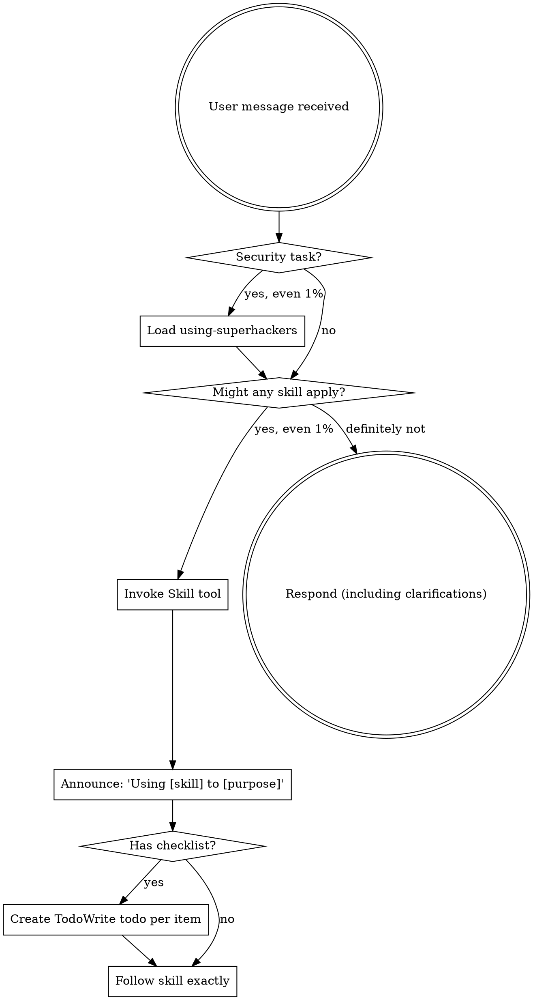

<EXTREMELY-IMPORTANT>
If you think there is even a 1% chance a skill might apply to what you are doing, you ABSOLUTELY MUST invoke the skill.

IF A SKILL APPLIES TO YOUR TASK, YOU DO NOT HAVE A CHOICE. YOU MUST USE IT.

This is not negotiable. This is not optional. You cannot rationalize your way out of this.
</EXTREMELY-IMPORTANT>

## How to Access Skills

**In Claude Code:** Use the `Skill` tool. When you invoke a skill, its content is loaded and presented to you—follow it directly. Never use the Read tool on skill files.

**In other environments:** Check your platform's documentation for how skills are loaded.

## Required Tools

> This is a meta/routing skill. Tool requirements depend on which sub-skills are invoked. Run `bash $SUPERHACKERS_ROOT/scripts/detect-tools.sh` for tool availability, or read `$SUPERHACKERS_ROOT/TOOLCHAIN.md` for the full resolution protocol. See [SETUP.md](../SETUP.md) for installation.

## Overview

This is the **entry point** for the superhackers skill system. Load this skill FIRST for any security-related task. It maps your task to the correct skill(s), defines the execution order, and ensures you follow the engagement workflow.

**You are a router, not an executor.** This skill tells you WHICH skills to load — the loaded skills tell you HOW to execute.

Never assume you know a skill's workflow. Load it, read it, then follow it.

## When to Use

- **ALWAYS** — this is the first skill loaded for any security task
- When the user asks for any security testing, assessment, or review
- When you need to determine which skill(s) apply to a task
- When planning a multi-phase engagement and need to sequence skills
- When switching between phases of an engagement (recon → testing → reporting)
- When the user's request is ambiguous and you need to route to the right skill

## The Rule

**Invoke relevant or requested skills BEFORE any response or action.** Even a 1% chance a skill might apply means that you should invoke the skill to check. If an invoked skill turns out to be wrong for the situation, you don't need to use it.



## Core Pattern

```
1. USER requests a security task
2. LOAD this skill (using-superhackers)
3. MATCH the task to the skill routing table
4. LOAD the matched skill(s) in the correct order
5. EXECUTE following the loaded skill's methodology
6. TRANSITION to the next skill when the current phase completes
7. ALWAYS end with writing-security-reports for documentation
```

## Quick Reference

### Skill Routing Table

| User Says | Load This Skill | Category |
|-----------|----------------|----------|
| "pentest a webapp" / "test the web app" | `webapp-pentesting` | Target-specific |
| "test the API" / "API security" | `api-pentesting` | Target-specific |
| "scan the network" / "test infrastructure" | `infra-pentesting` | Target-specific |
| "test the Android app" / "mobile security" | `android-pentesting` | Target-specific |
| "review this code for security" / "code audit" | `secure-code-review` | Target-specific |
| "do a security assessment" / "full assessment" | `security-assessment` | Orchestrator |
| "test everything" / "comprehensive assessment" | `assessment-orchestrator` | Orchestrator |
| "reconnaissance" / "enumerate" / "discover" | `recon-and-enumeration` | Phase |
| "exploit" / "get shell" / "escalate privileges" | `exploit-development` | Phase |
| "verify this vuln" / "is this exploitable" / "confirm" | `vulnerability-verification` | Phase |
| "write a report" / "document findings" | `writing-security-reports` | Deliverable |
| "wrap up" / "finish engagement" / "we're done" | `finishing-an-engagement` | Deliverable |

#### Technology/Framework/Protocol Skills (load when detected during recon)

| Detected Technology | Load This Skill | Category |
|-----------|----------------|----------|
| Next.js / React SSR / Vercel | `nextjs-security` | Framework |
| Supabase / PostgREST | `supabase-security` | Technology |
| Firebase / Firestore / RTDB | `firebase-security` | Technology |
| GraphQL endpoint detected | `graphql-security` | Protocol |
| FastAPI / Starlette / Uvicorn | `fastapi-security` | Framework |

**When to load technology skills:** These skills are loaded AS SUPPLEMENTS to the primary target-specific skill (webapp-pentesting, api-pentesting, etc.), not instead of them. Load them when `recon-and-enumeration` identifies the relevant technology in the target's stack. Multiple technology skills can be loaded simultaneously if the target uses multiple technologies (e.g., Next.js + Supabase + GraphQL).

#### Vulnerability Technique Sidecars (loaded on-demand during testing)

| Testing For | Reference File | Parent Skill |
|-------------|---------------|-------------|
| SQL Injection | `webapp-pentesting/sqli-techniques.md` | webapp-pentesting |
| XSS | `webapp-pentesting/xss-techniques.md` | webapp-pentesting |
| SSRF | `webapp-pentesting/ssrf-techniques.md` | webapp-pentesting |
| Auth/JWT/OAuth bypass | `webapp-pentesting/auth-bypass-techniques.md` | webapp-pentesting |
| Host Header injection | `webapp-pentesting/host-header-injection-techniques.md` | webapp-pentesting |

> **Note:** Business logic testing is now integrated directly into the `webapp-pentesting` skill (see A04 — Insecure Design section). The comprehensive domain-specific attack patterns (E-commerce, SaaS, Fintech, etc.) are part of the core skill workflow, not a separate sidecar.

**When to load sidecars:** During active testing when you encounter a specific vulnerability class and need payload-level technique guidance. Read the sidecar file directly — these are knowledge references, not workflow skills.

### Skill Categories

- **Orchestrator:** `security-assessment` — plans and sequences the full engagement
- **Orchestrator:** `assessment-orchestrator` — automatically discovers and assesses related components (APIs, subdomains, backend services)
- **Phase skills:** `recon-and-enumeration`, `vulnerability-verification`, `exploit-development` — used within any engagement type
- **Parallel execution:** `dispatching-parallel-agents` — coordinates multiple independent security tasks
- **Target-specific skills:** `webapp-pentesting`, `api-pentesting`, `infra-pentesting`, `android-pentesting`, `secure-code-review` — specialized methodology for a target type
- **Technology skills:** `nextjs-security`, `supabase-security`, `firebase-security`, `graphql-security`, `fastapi-security` — loaded as supplements when specific tech stack is detected during recon
- **Deliverable skills:** `writing-security-reports` — produces final output; `finishing-an-engagement` — engagement cleanup, evidence archival, state closure

### Priority Rules (NON-NEGOTIABLE)

1. **ALWAYS load `recon-and-enumeration` first** before any active testing. You cannot test what you haven't enumerated.
2. **ALWAYS verify before reporting.** Use `vulnerability-verification` on every finding before including it in a report.
3. **ALWAYS document findings as you go.** Don't wait until the end. Use `writing-security-reports` finding format during testing.
4. **NEVER skip reconnaissance.** Even for "quick checks" — at minimum, enumerate the attack surface.
5. **NEVER report unverified findings.** False positives destroy credibility.

### Context Window Awareness

During long engagements, prior conversation context may be summarized or compressed. When you detect summarized content (shorter-than-expected prior messages, loss of technical detail):

1. **Never trust summarized values** for: IP addresses, port numbers, URLs, credentials, CVSS scores, CWE IDs
2. **Re-verify** critical data by re-running the discovery command rather than quoting from summary
3. **Maintain a running findings log** in a file (not just in conversation) — this survives context compression
4. **Flag uncertainty**: If a prior finding's details are unclear from summary, state "details from prior context, re-verification recommended" in the report

### Skill Priority

When multiple skills could apply, use this order:

1. **Routing skill first** (using-superhackers) - determines WHICH skills to load
2. **Orchestrator skill second** (security-assessment) - plans the engagement sequence
3. **Phase skills third** (recon, verification, exploit-dev) - these determine HOW to approach phases
4. **Target-specific skills fourth** (webapp, api, infra, android, code review) - these guide execution
5. **Technology skills fifth** (nextjs, supabase, firebase, graphql, fastapi) - these supplement target-specific skills with stack-specific testing
6. **Deliverable skills last** (writing-security-reports) - these produce output

"Pentest this webapp" → using-superhackers first, then security-assessment, then recon, then webapp-pentesting, then verification, then reports.

## Red Flags

These thoughts mean STOP—you're rationalizing:

| Thought | Reality |
|---------|---------|
| "This is just a simple question" | Questions are tasks. Check for skills. |
| "I need more context first" | Skill check comes BEFORE clarifying questions. |
| "Let me explore the codebase first" | Skills tell you HOW to explore. Check first. |
| "I can run a quick nmap scan" | Skills define the methodology. Check first. |
| "Let me gather information first" | Skills tell you HOW to gather information. |
| "This doesn't need a formal skill" | If a skill exists, use it. |
| "I remember this skill" | Skills evolve. Read current version. |
| "This doesn't count as a security task" | Action = task. Check for skills. |
| "The skill is overkill" | Simple things become complex. Use it. |
| "I'll just do this one thing first" | Check BEFORE doing anything. |
| "This feels productive" | Undisciplined action wastes time. Skills prevent this. |
| "I know what that means" | Knowing the concept ≠ using the skill. Invoke it. |

## Skill Types

**Rigid** (recon-and-enumeration, vulnerability-verification, exploit-development): Follow exactly. Don't adapt away discipline. These have strict methodologies for a reason — skipping steps means missing findings.

**Flexible** (secure-code-review, writing-security-reports): Adapt principles to context. The framework guides you, but the specifics depend on the target.

The skill itself tells you which.

## User Instructions

Instructions say WHAT, not HOW. "Test this app" or "Find vulns" doesn't mean skip workflows. The skill defines the methodology — user instructions define the target and scope.


## Implementation

### 1. Skill Loading Protocol

When loading any superhackers skill:

```
Step 1: Identify the correct skill from the routing table
Step 2: Load the skill using the Skill tool: superhackers:skill-name
Step 3: READ the entire skill before executing anything
Step 4: Follow the skill's Core Pattern step by step
Step 5: Do NOT deviate from the skill's methodology
Step 6: When complete, return here to determine the next skill
```

**Critical rule:** Never assume you know a skill's content. Skills are updated independently. Always load and read the current version before executing.

### 2. Engagement Flow — Standard Sequence

A typical security engagement flows through skills in this order:

```
┌─────────────────────────────────────────────────────────┐
│ Phase 1: PLANNING                                       │
│ Skill: security-assessment                              │
│ → Define scope, rules of engagement, objectives         │
│ → Select target-specific skills needed                  │
└──────────────────────┬──────────────────────────────────┘
                       │
                       ▼
┌─────────────────────────────────────────────────────────┐
│ Phase 2: RECONNAISSANCE                                 │
│ Skill: recon-and-enumeration                            │
│ → Passive recon, active enumeration, attack surface map │
│ → Output: target inventory, technology stack, endpoints │
└──────────────────────┬──────────────────────────────────┘
                       │
                       ▼
┌─────────────────────────────────────────────────────────┐
│ Phase 3: TESTING (load target-specific skill)           │
│ Skill: webapp-pentesting | api-pentesting |             │
│        infra-pentesting | android-pentesting |          │
│        secure-code-review                               │
│ → Execute testing methodology for the target type       │
│ → Output: raw findings, potential vulnerabilities       │
└──────────────────────┬──────────────────────────────────┘
                       │
                       ▼
┌─────────────────────────────────────────────────────────┐
│ Phase 4: VERIFICATION                                   │
│ Skill: vulnerability-verification                       │
│ → Confirm each finding is real and reproducible         │
│ → Determine actual severity and impact                  │
│ → Output: verified findings with evidence               │
└──────────────────────┬──────────────────────────────────┘
                       │
                       ▼
┌─────────────────────────────────────────────────────────┐
│ Phase 5: EXPLOITATION (if authorized and needed)        │
│ Skill: exploit-development                              │
│ → Demonstrate real-world impact of verified vulns       │
│ → Privilege escalation, lateral movement, data access   │
│ → Output: exploitation evidence, impact proof           │
└──────────────────────┬──────────────────────────────────┘
                       │
                       ▼
┌─────────────────────────────────────────────────────────┐
│ Phase 6: REPORTING                                      │
│ Skill: writing-security-reports                         │
│ → Compile all findings into deliverable                 │
│ → Write executive summary, remediation guidance         │
│ → Output: final report deliverable                      │
└──────────────────────┬──────────────────────────────────┘
                       │
                       ▼
┌─────────────────────────────────────────────────────────┐
│ Phase 7: CLOSURE (optional)                             │
│ Skill: finishing-an-engagement                          │
│ → Verify all findings documented, archive evidence      │
│ → Clean up engagement state and temporary files         │
│ → Output: archived engagement, clean workspace          │
└─────────────────────────────────────────────────────────┘
```

**Not every engagement uses all phases.** A code review skips Phases 1, 2, and 5. A quick vuln check might only use Phases 3 and 4. Match the flow to the task.

### 3. Skill Composition — Multi-Skill Examples

#### Example: Full Web Application Pentest

```
User: "Do a full pentest of our web application at https://app.example.com"

Skills loaded (in order):
1. using-superhackers        → You are here. Route to engagement flow.
2. security-assessment       → Plan scope, rules of engagement, select depth
3. assessment-orchestrator    → Discover related components (APIs, subdomains, CDN)
4. recon-and-enumeration     → Enumerate subdomains, endpoints, tech stack
   ↳ Tech detected: Next.js + Supabase + GraphQL
5. webapp-pentesting         → OWASP Top 10 testing, business logic, auth
   ↳ nextjs-security         → Next.js-specific testing (middleware bypass, RSC, __NEXT_DATA__)
   ↳ supabase-security       → Supabase-specific testing (RLS, PostgREST, Storage)
   ↳ graphql-security        → GraphQL-specific testing (introspection, batching, auth bypass)
   ↳ Sidecars as needed      → sqli-techniques.md, xss-techniques.md, etc.
6. vulnerability-verification → Verify all findings, eliminate false positives
7. exploit-development       → Demonstrate impact of critical findings
8. writing-security-reports  → Full pentest report with executive summary
```

#### Example: API Security Review

```
User: "Test the API for security issues"

Skills loaded (in order):
1. using-superhackers        → Route to API testing
2. recon-and-enumeration     → Discover endpoints, auth mechanisms, schemas
3. api-pentesting            → API-specific testing (BOLA, injection, auth)
4. vulnerability-verification → Verify findings
5. writing-security-reports  → API security assessment report
```

#### Example: Quick Vulnerability Check

```
User: "Is this endpoint vulnerable to SQLi?"

Skills loaded (in order):
1. using-superhackers        → Route to verification
2. vulnerability-verification → Test and confirm the specific vulnerability
3. writing-security-reports  → Quick advisory (if confirmed)
```

#### Example: Code Review Only

```
User: "Review this code for security issues"

Skills loaded (in order):
1. using-superhackers        → Route to code review
2. secure-code-review        → Static analysis, manual review, taint tracking
3. writing-security-reports  → Code review report
```

#### Example: Infrastructure Assessment

```
User: "Scan the network and find vulnerabilities"

Skills loaded (in order):
1. using-superhackers        → Route to infra testing
2. recon-and-enumeration     → Network discovery, port scanning, service enum
3. infra-pentesting          → Service exploitation, misconfig testing
4. vulnerability-verification → Verify findings
5. exploit-development       → Demonstrate impact (if authorized)
6. writing-security-reports  → Infrastructure assessment report
```

### 4. Handling Ambiguous Requests

When the user's request doesn't clearly map to a skill:

```
1. Ask clarifying questions:
   - What is the target? (webapp, API, network, mobile app, code)
   - What is the objective? (find vulns, compliance check, specific concern)
   - What access do you have? (black box, gray box, white box)
   - What's the scope? (specific endpoint, full application, entire network)

2. Default routing for ambiguous terms:
   - "security test" → security-assessment (orchestrator)
   - "hack this" → Ask: what is "this"? Then route accordingly
   - "check for vulnerabilities" → Ask: in what? Then route accordingly
   - "is this secure?" → secure-code-review (if code) or vulnerability-verification (if running system)
```

### 5. Skill Transition Protocol

When moving from one skill to the next:

```
1. COMPLETE the current skill's workflow fully
2. DOCUMENT any findings before transitioning
3. CARRY FORWARD outputs from the current skill as inputs to the next
4. LOAD the next skill fresh — do not rely on memory of previous loads
5. BRIEF the next skill's methodology with context from previous phases
```

Key outputs that carry between skills:

| From Skill | Output | Consumed By |
|-----------|--------|-------------|
| recon-and-enumeration | Target inventory, endpoints, tech stack | All testing skills + technology skill selection |
| webapp/api/infra-pentesting | Raw findings, potential vulns | vulnerability-verification |
| vulnerability-verification | Verified findings with evidence | exploit-development, writing-security-reports |
| exploit-development | Impact evidence, proof of exploitation | writing-security-reports |
| writing-security-reports | Final report deliverable | finishing-an-engagement |

## Tool Availability

> **IMPORTANT**: Before using any security tool, run `bash $SUPERHACKERS_ROOT/scripts/detect-tools.sh` for tool availability, or read `$SUPERHACKERS_ROOT/TOOLCHAIN.md` for the full resolution protocol.

### Pre-Flight Check (Run Once Per Session)

**Primary method** — use the automated preflight script:

```bash
bash $SUPERHACKERS_ROOT/scripts/preflight.sh --engagement-type <type>
```

**Fallback** — manual tool availability check:

```bash
# Quick tool availability check
for tool in nmap ffuf nuclei httpx sqlmap nikto curl john hashcat \
   msfconsole msfvenom adb jadx apktool frida mitmproxy bettercap; do
  printf "%-15s %s\n" "$tool" "$(command -v $tool >/dev/null 2>&1 && echo '✅' || echo '❌')"
done
```

### Tool Resolution Rules

1. **Tool available locally** → Use directly
2. **Tool missing** → Use fallback chain from `$SUPERHACKERS_ROOT/TOOLCHAIN.md`
3. **No tool, no fallback** → Report to user with install instructions from [SETUP.md](../SETUP.md)

### Wordlist Resolution

Skills reference wordlists at `/usr/share/wordlists/`. If this path doesn't exist:
1. Check `$SUPERHACKERS_WORDLISTS` environment variable
2. Check `~/wordlists/`
3. If none found, inform user and reference [wordlists/README.md](../wordlists/README.md)

### Command Execution Protocol

When executing security tools, follow these rules:

1. **Timeouts**: Always set timeouts for scanning tools
   - Quick scans: `timeout 120` prefix (nmap targeted, curl, httpx)
   - Deep scans: `timeout 1200` prefix (nmap full, nikto, nuclei full)
   - Never run a command without a timeout in an automated context

2. **Output Management**: Redirect output to files for evidence preservation
   - `nmap -oA scan_results ...` (not just stdout)
   - `nuclei -o nuclei_findings.txt ...`
   - `ffuf -o ffuf_results.json -of json ...`

3. **Background Execution**: For long-running scans, use background execution
   - `nmap -sV -p- target -oA full_scan &` then continue with quick-win testing
   - Check results later with `wait` or file monitoring

4. **Working Directory**: Create engagement-specific directories
   - `mkdir -p /tmp/engagement_name/{recon,scans,exploits,evidence,report}`
   - All output files go in the appropriate subdirectory

5. **Auto-approve**: Use non-interactive flags
   - `apt-get install -y`, `pip install --yes`

6. **Retry Policy**: If a command fails, diagnose before retrying
   - Check: network connectivity, tool installed, permissions, correct syntax
   - Max 3 retries, then switch to fallback tool from the tool table

### Output Validation Protocol (MANDATORY)

After running ANY scanning or enumeration tool, you MUST validate the output:

```bash
bash $SUPERHACKERS_ROOT/scripts/validate-output.sh <tool_name> <output_file> <exit_code>
```

**Preferred**: Use the `run-tool.sh` wrapper which auto-validates:

```bash
bash $SUPERHACKERS_ROOT/scripts/run-tool.sh <tool> <timeout> <output_file> -- <command...>
```

**If `VALIDATION=failed`:**
1. Read the `REASON` and `DIAGNOSIS` fields
2. Apply the suggested `ACTION`
3. Re-run the tool with corrected configuration
4. If validation fails 3 times: **STOP** and report the tool failure to the user. Do NOT generate an assessment from empty data.

**CRITICAL RULE**: An empty scan result is NOT the same as "no findings." Empty output means the tool failed silently. A clean target still produces structural output (e.g., nmap reports "all ports filtered", nuclei reports "X requests sent"). Never conflate tool failure with a clean assessment.

### Error Classification (check BEFORE retrying)

| Error Signal | Classification | Action |
|---|---|---|
| "Permission denied", "Operation not permitted" | **Non-retryable (permissions)** | Run with sudo |
| "No route to host", "Connection refused" | **Non-retryable (target)** | Verify target is reachable first — do NOT retry |
| "command not found" | **Non-retryable (missing tool)** | Run preflight, install or use fallback chain |
| "Temporary failure in name resolution" | **Retryable (network)** | Wait 10s, retry (max 2) |
| Timeout / partial output | **Retryable (performance)** | Reduce scope (fewer ports/paths), retry |
| Non-zero exit + meaningful stderr | **Retryable (config)** | Fix args per stderr message, retry |
| Non-zero exit + empty stderr | **Non-retryable (unknown)** | Switch to fallback tool |

**NEVER retry a non-retryable error. NEVER proceed past a non-retryable error without user acknowledgment or tool switch.**

### Loop Detection Protocol

Maintain a mental log of the last 3 commands executed. If you are about to run a command that is >80% similar to one of the last 3 (same tool, same target, same key arguments), STOP and do one of:
1. Explain to the user why you're stuck and what you've tried
2. Switch to a completely different tool from the fallback chain
3. Reduce scope (fewer ports, different wordlist, single endpoint)

**NEVER run the same failing command more than twice.**

### Inter-Skill Data Contract

When transitioning between skills, pass findings in this standardized format:

**Finding Record** (used by all testing skills):

    FINDING-[NNN]
    - Title: [descriptive, specific title]
    - Severity: [Critical/High/Medium/Low/Info]
    - Target: [exact URL, IP:port, file:line]
    - Type: [CWE-XXX or OWASP category]
    - Status: [Unverified/Verified/False Positive/Mitigated]
    - Evidence: [file path to saved evidence or inline snippet]
    - Reproduction: [numbered steps, exact commands]
    - Phase Found: [recon/testing/verification]

**Recon Handoff** (recon to testing skills):

    TARGET-INVENTORY
    - Scope: [in-scope targets list]
    - Endpoints: [discovered URLs/APIs]
    - Tech Stack: [detected technologies and skill routing hints]
    - Auth: [discovered auth mechanisms]
    - Priority Targets: [ordered by likely impact]

Skills MUST produce their output in these formats. Downstream skills MUST accept them as input.

### Engagement State Persistence

Maintain engagement state in files to survive context window compression:

1. **Create state file at engagement start**: Create `/tmp/engagement/state/engagement.md` with sections for Scope, Discovered Assets, Findings Log, and Testing Progress checklist

2. **Update after each significant action**: Append findings, mark completed phases

3. **Read before reporting**: Use this file as the source of truth, not conversation memory

4. **Include in handoff**: When transitioning between skills, reference this file

Run `bash $SUPERHACKERS_ROOT/scripts/engagement-init.sh <name> <target>` at engagement start to create the directory structure and state file.

## Common Mistakes

### 1. Skipping This Skill
**Problem:** Jumping directly to a testing skill without routing through using-superhackers leads to missed phases, wrong skill selection, or incomplete engagements.
**Fix:** ALWAYS load this skill first. Even if you think you know which skill to use.

### 2. Loading Skills Without Reading Them
**Problem:** Assuming you know a skill's methodology from a previous load. Skills are updated independently.
**Fix:** Load AND read the skill every time. Follow the current version's Core Pattern.

### 3. Wrong Skill Selection
**Problem:** Using webapp-pentesting for an API, or infra-pentesting for a web application.
**Fix:** Consult the routing table. If ambiguous, ask the user to clarify the target type.

### 4. Skipping Reconnaissance
**Problem:** Starting active testing without understanding the attack surface wastes time and misses targets.
**Fix:** ALWAYS load recon-and-enumeration before any testing skill. No exceptions.

### 5. Skipping Verification
**Problem:** Reporting findings directly from testing without verification leads to false positives, incorrect severity ratings, and lost client trust.
**Fix:** ALWAYS run vulnerability-verification before writing-security-reports. Every finding must be confirmed.

### 6. Not Documenting During Testing
**Problem:** Waiting until the reporting phase to document findings. Details are lost, evidence is incomplete.
**Fix:** Use writing-security-reports' finding format DURING testing. Document each finding immediately when discovered.

### 7. Running All Skills When Not Needed
**Problem:** Loading all 7 skills for a simple "is this vulnerable?" question wastes time.
**Fix:** Match the skill chain to the task scope. A quick check needs 2-3 skills, not the full pipeline. See the composition examples above.

### 8. Not Carrying Context Between Skills
**Problem:** Each skill phase starts from scratch, re-discovering what previous phases already found.
**Fix:** Follow the Skill Transition Protocol. Explicitly pass outputs from one skill as inputs to the next. The recon output is the testing input. The testing output is the verification input.
