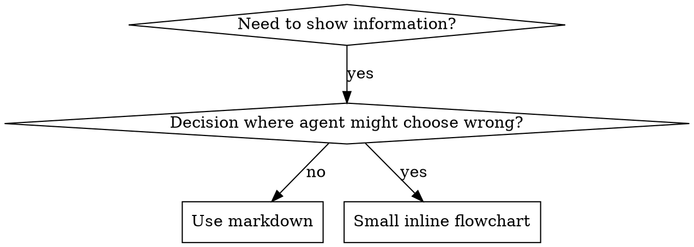

# Writing Security Skills

## Required Tools

> This is a meta-skill for creating new skills. It requires no external security tools — only file system access to create and edit skill files.

| Tool | Required | Purpose | Fallback |
|------|----------|---------|----------|
| File editor | ✅ Yes | Creating and editing SKILL.md files | Manual editing |
| ripgrep (rg) | ⚡ Optional | Checking existing skill patterns for consistency | grep → find |

## File Operations Protocol

**When creating or editing skill files, follow this protocol:**

1. **Verify file operations succeed**
   ```bash
   # Create new skill file with validation
   SKILL_DIR="skills/my-new-skill"
   SKILL_FILE="$SKILL_DIR/SKILL.md"

   mkdir -p "$SKILL_DIR" 2>/dev/null
   if [ $? -ne 0 ]; then
     echo "TOOL_FAILURE: Cannot create directory: $SKILL_DIR"
     exit 1
   fi

   # Write skill file
   cat > "$SKILL_FILE" << 'EOF'
   ---
   name: my-new-skill
   description: "Use when..."
   ---
   # Skill content here
   EOF

   if [ $? -ne 0 ]; then
     echo "TOOL_FAILURE: Cannot write to file: $SKILL_FILE"
     exit 1
   fi

   echo "SUCCESS: Skill file created"
   ```

2. **Pattern validation with error handling**
   ```bash
   # Check for conflicting skill names
   NEW_SKILL_NAME="my-new-skill"
   EXISTING_SKILL=$(rg -l "^name: $NEW_SKILL_NAME" skills/*/SKILL.md 2>/dev/null)

   if [ -n "$EXISTING_SKILL" ]; then
     echo "WARNING: Skill name '$NEW_SKILL_NAME' already exists"
     echo "Existing: $EXISTING_SKILL"
     echo "Use a different name or update the existing skill"
   fi

   # Check for pattern consistency
   rg "TODO|FIXME|XXX" "$SKILL_FILE" 2>/dev/null
   if [ $? -eq 0 ]; then
     echo "WARNING: Found TODO/FIXME markers in skill file"
     echo "Address these before finalizing"
   fi
   ```

## Overview

**Writing security skills IS scenario-driven testing applied to security documentation.**

You write attack scenarios (pressure tests with subagents), watch them fail (baseline behavior without the skill), write the skill (operational methodology), watch scenarios pass (agents follow the skill), and refactor (close gaps where agents deviate or miss steps).

**Core principle:** If you didn't watch an agent fail without the skill, you don't know if the skill teaches the right thing.

**Every security skill must answer:** "Given this target/scenario, what exact commands do I run, in what order, and what do I do with the results?"

## What is a Security Skill?

A **security skill** is an operational reference for proven attack techniques, assessment methodologies, security tools, or engagement workflows. Skills help future agents find and apply effective security approaches without re-deriving them.

**Security skills are:** Reusable techniques, attack methodologies, tool references, engagement workflows

**Security skills are NOT:**
- War stories about a specific pentest engagement
- Generic security advice available in OWASP documentation
- One-off scripts for a specific target
- Compliance checklists (put those in engagement-specific documents)

## Security Scenario Testing Mapping

| Security Scenario Testing | Skill Creation |
|---------------------------|----------------|
| **Attack scenario** | Pressure test with subagent |
| **Operational guide** | Skill document (SKILL.md) |
| **Scenario fails (RED)** | Agent misses attack vectors without skill (baseline) |
| **Scenario passes (GREEN)** | Agent executes methodology correctly with skill |
| **Refactor** | Close gaps while maintaining coverage |
| **Write scenario first** | Run baseline scenario BEFORE writing skill |
| **Watch it fail** | Document exact attack vectors agent misses |
| **Minimal skill** | Write skill addressing those specific gaps |
| **Watch it pass** | Verify agent now covers all vectors |
| **Refactor cycle** | Find new gaps → plug → re-verify |

The entire skill creation process follows RED-GREEN-REFACTOR adapted for security operations.

## When to Create a Security Skill

**Create when:**
- Attack technique or methodology wasn't intuitively obvious
- You'd reference this approach again across engagements
- Pattern applies broadly (not target-specific)
- Methodology requires specific tool sequences or flag combinations
- Others would miss critical attack vectors without guidance

**Don't create for:**
- One-off exploits for a specific CVE on a specific target
- Standard practices well-documented in tool manuals (e.g., basic nmap usage)
- Engagement-specific configurations (put in engagement notes)
- Mechanical constraints enforceable with automation (if a scanner does it reliably, don't document manual steps)

## Skill Types

### Technique
Concrete attack method with exact commands and decision points.
Examples: SQL injection via error-based extraction, JWT algorithm confusion attacks, SSRF cloud metadata harvesting.

### Methodology
Structured assessment approach for a target type or security domain.
Examples: webapp-pentesting (OWASP Top 10 assessment), api-pentesting (API security testing), android-pentesting (mobile app analysis).

### Reference
Tool documentation, payload collections, protocol specifications.
Examples: msfvenom payload quick reference, hash identification guide, HTTP security headers reference.

### Workflow
End-to-end engagement process spanning multiple phases.
Examples: using-superhackers (skill router), security-assessment (engagement orchestrator), writing-security-reports (deliverable production).

## Directory Structure

```
skills/
  skill-name/
    SKILL.md              # Main reference (required)
    supporting-file.*     # Only if needed
```

**Flat namespace** — all skills in one searchable namespace.

**Separate files for:**
1. **Heavy reference** (100+ lines) — payload collections, protocol specs
2. **Reusable tools** — Scripts, nuclei templates, wordlists

**Keep inline:**
- Attack methodology and decision logic
- Command examples (< 50 lines per section)
- Checklists and quick reference tables

## SKILL.md Structure

**Frontmatter (YAML):**
- Only two fields supported: `name` and `description`
- Max 1024 characters total
- `name`: Use letters, numbers, and hyphens only (no parentheses, special chars)
- `description`: Third-person, describes ONLY when to use (NOT what it does)
  - Start with "Use when..." to focus on triggering conditions
  - Include specific attack scenarios, target types, and symptoms
  - **NEVER summarize the skill's methodology or workflow** (see CSO section)
  - Keep under 500 characters if possible

```markdown
---
name: Skill-Name-With-Hyphens
description: "Use when [specific triggering conditions, target types, attack scenarios]"
---
# Skill Name
## Overview
What is this? Core operational principle in 1-2 sentences.
Authorization assumption statement.
## When to Use
[Small inline flowchart IF routing decision non-obvious]
Bullet list with TARGET TYPES, ATTACK SCENARIOS, and use cases
When NOT to use
## Core Pattern
Attack phase sequence or methodology flow
## Quick Reference
Table with tools, commands, and phases for quick scanning
## Implementation
Detailed methodology with exact commands per phase
Organized by attack category or assessment phase
## Common Mistakes
What goes wrong in real engagements + fixes
```

## Claude Search Optimization (CSO)

**Critical for discovery:** Future agents need to FIND your skill when facing a security task.

### 1. Rich Description Field

**Purpose:** Agents read the description to decide which skills to load. Make it answer: "Should I load this skill right now?"

**CRITICAL: Description = When to Use, NOT What the Skill Does**

The description should ONLY describe triggering conditions. Do NOT summarize the skill's methodology or attack sequence.

**Why this matters:** When a description summarizes methodology, agents may follow the description shortcut instead of reading the full skill. A description saying "tests OWASP Top 10 with nuclei scanning then manual BurpSuite verification" causes agents to run nuclei + BurpSuite and skip the skill's full phase-by-phase methodology.

**The trap:** Descriptions that summarize attack methodology create a shortcut agents will take. The skill body becomes documentation agents skip.

```yaml
# ❌ BAD: Summarizes methodology - agents may follow this instead
description: "Use when pentesting webapps - runs nmap, then nuclei scan, then manual BurpSuite testing of OWASP Top 10"

# ❌ BAD: Too abstract
description: "For security testing"

# ✅ GOOD: Just triggering conditions, no methodology summary
description: "Use when testing web applications for security vulnerabilities, performing webapp penetration tests, assessing OWASP Top 10 risks, testing for XSS/SQLi/CSRF/SSRF"

# ✅ GOOD: Target types and attack scenarios only
description: "Use when needing to exploit a confirmed vulnerability, generate payloads, craft reverse shells, use Metasploit modules, write custom exploit scripts"
```

**Content guidelines:**
- Use concrete triggers: target types, vulnerability classes, tool names, attack scenarios
- Describe the *target or situation* not *tool-specific steps*
- Include common phrasings users might use ("pentest", "hack", "pwn", "pop a shell")
- Write in third person (injected into system prompt)
- **NEVER summarize the skill's methodology or attack sequence**

### 2. Keyword Coverage

Use words agents would search for:
- Vulnerability classes: "SQL injection", "XSS", "SSRF", "IDOR", "RCE", "LFI"
- Tools: "nmap", "sqlmap", "nuclei", "BurpSuite", "Metasploit", "ffuf"
- Target types: "web application", "API", "mobile app", "infrastructure"
- Attack outcomes: "reverse shell", "privilege escalation", "data exfiltration"
- User phrasings: "pentest", "exploit", "hack", "vulnerability", "security assessment"

### 3. Descriptive Naming

**Use attack-action verbs or target descriptors:**
- ✅ `webapp-pentesting` not `web-security`
- ✅ `exploit-development` not `exploitation-techniques`
- ✅ `recon-and-enumeration` not `information-gathering`

**Gerunds (-ing) work well for ongoing processes:**
- `writing-security-reports`, `webapp-pentesting`

### 4. Token Efficiency (Critical)

**Problem:** Router skills and frequently-loaded skills consume context in every engagement. Every token counts.

**Target word counts:**
- Router/getting-started skills: <300 words each
- Frequently-loaded skills: <500 words total
- Methodology skills: one best approach per scenario

**Techniques:**

**Reference tool documentation, don't duplicate it:**
```bash
# ❌ BAD: Document all sqlmap flags in SKILL.md
sqlmap supports --batch, --dbs, --tables, --dump, --level, --risk, --tamper...

# ✅ GOOD: Show the command patterns agents actually need
sqlmap -u "URL" --batch --level 3 --risk 2 -o  # Standard scan
sqlmap -u "URL" --batch --dbs                    # Enumerate databases
```

**Use cross-references instead of repeating content:**
```markdown
# ❌ BAD: Repeat methodology from another skill
When exploiting confirmed findings, set up Metasploit handler...
[30 lines of repeated exploit-development content]

# ✅ GOOD: Reference the other skill
**REQUIRED SUB-SKILL:** Use superhackers:exploit-development for exploitation phase.
```

**Compress examples — show the command, not the narrative:**
```markdown
# ❌ BAD: Verbose narrative (45 words)
First, we need to scan the target for open ports using nmap.
We'll use the -sV flag for version detection and -sC for default scripts.

# ✅ GOOD: Just the command with inline comment (15 words)
nmap -sV -sC -p- -oN scan.txt TARGET  # Full port scan + version detection
```

**Eliminate redundancy:**
- Don't repeat what's in cross-referenced skills
- Don't explain what's obvious from the command flags
- Don't include multiple examples of the same pattern

### 5. Cross-Referencing Other Skills

Use skill name only, with explicit requirement markers:
- ✅ Good: `**REQUIRED SUB-SKILL:** Use superhackers:exploit-development`
- ✅ Good: `**REQUIRED SUB-SKILL:** Use superhackers:vulnerability-verification for confirming findings.`
- ❌ Bad: `See skills/exploit-development/SKILL.md` (unclear if required)
- ❌ Bad: `@skills/exploit-development/SKILL.md` (force-loads, burns context)

**Why no @ links:** `@` syntax force-loads files immediately, consuming 200k+ context before you need them.

## Flowchart Usage



**Use flowcharts ONLY for:**
- Non-obvious routing decisions (which attack vector to try first)
- Engagement phase transitions with conditional logic
- "When to use tool A vs tool B" decisions

**Never use flowcharts for:**
- Command references → Code blocks
- Attack checklists → Checkbox lists
- Linear methodology steps → Numbered lists
- Payload collections → Code blocks or tables

**Graphviz conventions:** Use `dot` format. Decision nodes: `[shape=diamond]`. Action nodes: `[shape=box]`. Semantic labels on edges (never "step1", "step2").

## Security Code Examples

**The Triad: Vulnerable Code → Exploit → Fix**

Every security skill with code examples MUST show three components:

```markdown
### Example: SQL Injection in Login Form

**❌ VULNERABLE:**
```python
# Direct string concatenation — SQL injection
query = f"SELECT * FROM users WHERE username='{username}' AND password='{password}'"
cursor.execute(query)
```

**💀 EXPLOIT:**
```bash
# Authentication bypass via SQL injection
sqlmap -u "https://target.com/login" --data="username=admin&password=test" --batch --level 3
# Manual: username = admin' OR '1'='1' --
```

**✅ FIX:**
```python
# Parameterized query — prevents SQL injection
query = "SELECT * FROM users WHERE username=%s AND password=%s"
cursor.execute(query, (username, password))
```
```

**Why the triad matters:**
- Vulnerable code shows WHAT to look for during assessment
- Exploit shows HOW to confirm the vulnerability
- Fix shows WHAT to recommend in the report

**Guidelines:**
1. **One excellent triad beats many mediocre ones** — pick the most representative attack
2. **Use the language matching the target** — PHP for web apps, Python for scripts, bash for tools
3. **Exploits must be realistic** — real payloads, real tool commands
4. **Fixes must be production-ready** — parameterized queries, not "sanitize input"
5. **Never show destructive exploits without context** — always include scope/authorization reminders

## Tool Integration Documentation

When documenting security tools in a skill:

```markdown
### Tool: sqlmap

**Purpose:** Automated SQL injection detection and exploitation

**Common Invocations:**
```bash
sqlmap -u "URL?param=value" --batch --level 3 --risk 2 -o      # Detection
sqlmap -u "URL?param=value" --batch --dbs                        # Enumerate DBs
sqlmap -u "URL?param=value" --tamper=space2comment --batch       # WAF bypass
```

**Integration:** Proxy via BurpSuite (`--proxy`), use saved requests (`-r file.txt`), combine with ffuf/recon output.
```

**Rules:**
- Show 2-3 most common invocations, not every flag
- Always include `--batch` or equivalent for non-interactive usage
- Reference `--help` for comprehensive flag documentation
- Show how the tool integrates with other tools in the methodology

## CVSS-Aware Severity Sections

When a skill documents vulnerabilities, include CVSS context:

| Severity | CVSS Range | Example Findings |
|----------|-----------|------------------|
| Critical | 9.0-10.0 | RCE, auth bypass to admin, SQLi with data dump |
| High | 7.0-8.9 | Stored XSS, SSRF to internal services, privilege escalation |
| Medium | 4.0-6.9 | Reflected XSS, CSRF on non-critical functions, info disclosure |
| Low | 0.1-3.9 | Missing headers, verbose errors, clickjacking |
| Info | 0.0 | Observations, best practice recommendations |

**CVSS Vector String Format:** `CVSS:4.0/AV:N/AC:L/AT:N/PR:N/UI:N/VC:H/VI:H/VA:H/SC:H/SI:H/SA:H`

**Always include:** CVSS v4.0 score with vector string, business impact context (not just technical severity), and remediation priority based on exploitability.

**When to include severity guidance:**
- Methodology skills covering vulnerability classes (always)
- Technique skills (include for the demonstrated vulnerability)
- Reference skills (only if covering vulnerability categorization)
- Workflow skills (never — severity belongs in methodology skills)

## OWASP/CWE/CVE Cross-Referencing

**Standard references make skills authoritative and searchable.**

```markdown
**For vulnerability classes:**
- **OWASP Top 10:** A03:2021 — Injection
- **CWE:** CWE-89 (SQL Injection), CWE-79 (XSS), CWE-918 (SSRF)

**For specific vulnerabilities:**
- **CVE:** CVE-2021-44228 (Log4Shell)
- **CVSS:** 10.0 (CVSS:4.0/AV:N/AC:L/AT:N/PR:N/UI:N/VC:H/VI:H/VA:H/SC:H/SI:H/SA:H)

**For methodology alignment:**
- **OWASP Testing Guide:** WSTG-INPV-05 (SQL Injection)
- **PTES:** Vulnerability Analysis phase
```

**Rules:**
- ALWAYS map vulnerability classes to OWASP Top 10 (2021) categories
- ALWAYS include CWE IDs for specific vulnerability types
- Include CVE IDs only for specific known vulnerabilities (not classes)
- Reference OWASP Testing Guide section IDs when documenting test procedures
- Keep references inline, not in a separate bibliography

Verify scores programmatically with Python cvss library: `from cvss import CVSS4`

## File Organization

**Self-Contained:** `jwt-attacks/SKILL.md` — everything inline. Use when all methodology and payloads fit in one file.

**With Payload Collection:** `xss-filter-bypass/SKILL.md` + `payloads.txt` — separate file when payload list exceeds 50 lines.

**With Heavy Reference:** `webapp-pentesting/SKILL.md` + `nuclei-templates/` + `wordlists/` — separate supporting files when they're reusable tools, not just narrative.

## The Iron Law

```
NO SKILL WITHOUT A FAILING SCENARIO FIRST
```

This applies to NEW skills AND EDITS to existing skills.

Write skill before testing? Delete it. Start over.
Edit skill without testing? Same violation.

**No exceptions:**
- Not for "simple additions"
- Not for "just adding a new tool section"
- Not for "updating commands for a new tool version"
- Don't keep untested changes as "reference"
- Don't "adapt" while running scenarios
- Delete means delete

## Testing All Security Skill Types

### Technique Skills (attack methods)
**Examples:** SQL injection methodology, JWT attacks, SSRF exploitation
**Test with:** Target application scenarios, WAF bypass variations, methodology gap detection, tool failure fallbacks.
**Success criteria:** Agent identifies and exploits the vulnerability following the skill's methodology.

### Methodology Skills (assessment frameworks)
**Examples:** webapp-pentesting, api-pentesting, infra-pentesting
**Test with:** Coverage scenarios (all categories tested?), phase transition tests, completeness checks, time pressure scenarios.
**Success criteria:** Agent completes full methodology without skipping phases.

### Reference Skills (tool docs, payload collections)
**Examples:** msfvenom payload reference, hash identification guide
**Test with:** Retrieval scenarios, correct application in context, gap testing, accuracy verification.
**Success criteria:** Agent finds and correctly applies reference information.

### Workflow Skills (engagement processes)
**Examples:** using-superhackers, security-assessment, writing-security-reports
**Test with:** Routing accuracy, phase sequencing, ambiguous request handling, context carry-forward.
**Success criteria:** Agent routes to correct skills and follows engagement flow.

## Common Rationalizations for Skipping Testing

| Excuse | Reality |
|--------|---------|
| "The commands are obviously correct" | Commands with wrong flags or outdated syntax break engagements. Test them. |
| "It's just a tool reference" | References with gaps cause agents to miss attack vectors. Test retrieval. |
| "Testing security skills is dangerous" | Test against intentionally vulnerable targets (DVWA, HackTheBox). No excuse. |
| "I'll test if problems emerge" | Problems = missed vulns in real engagements. Test BEFORE deploying. |
| "Too tedious to test" | Less tedious than missing a critical finding because the skill had a gap. |
| "I'm a security expert, it's fine" | Overconfidence causes missed attack vectors. Test anyway. |
| "The OWASP guide covers this" | Your skill adds operational specifics beyond OWASP. Those need testing. |
| "No time to test" | Deploying untested skills wastes more time when agents miss findings. |

**All of these mean: Test before deploying. No exceptions.**

## Bulletproofing Security Skills

Skills that enforce engagement methodology need to resist shortcuts. Agents are efficient and will skip phases when under pressure.

### Close Every Loophole Explicitly

Don't just state the methodology — forbid specific shortcuts:

```markdown
## ❌ BAD
Run reconnaissance before testing.

## ✅ GOOD
Run reconnaissance before testing.

**No exceptions:**
- Don't skip recon because "the user already gave me the URL"
- Don't skip recon because "I can see it's a WordPress site"
- Don't skip recon because "the user wants a quick check"
- A URL is not reconnaissance. Enumerate the full attack surface.
```

### Build Rationalization Table

Capture rationalizations from baseline testing. Every excuse agents make goes in a table:

```markdown
| Excuse | Reality |
|--------|---------|
| "User said just check for SQLi" | Check for SQLi AND everything else in scope. |
| "Scanner found nothing" | Scanners miss business logic, auth bypass, chained vulns. |
| "It's just a quick check" | Quick checks still follow methodology. Skip phases = miss findings. |
```

### Create Red Flags List

```markdown
## Red Flags — STOP and Reassess
- Skipping reconnaissance
- Reporting scanner output without verification
- Not testing authenticated functionality
- Testing only one vulnerability class
- "The scanner didn't find anything, so it's secure"

**All of these mean: Go back and follow the full methodology.**
```

## RED-GREEN-REFACTOR for Security Skills

### RED: Write Failing Scenario (Baseline)

Run attack scenario with subagent WITHOUT the skill. Document exact behavior:
- What attack vectors did they miss?
- What tools did they skip?
- What methodology steps did they shortcut?
- What rationalizations did they use for skipping steps?

This is "watch the scenario fail" — you must see what agents naturally miss before writing the skill.

### GREEN: Write Minimal Skill

Write skill that addresses those specific gaps. Don't add content for hypothetical attack scenarios not seen in baseline.

Run same scenarios WITH skill. Agent should now cover all vectors.

### REFACTOR: Close Gaps

Agent found a new way to shortcut the methodology? Add explicit counter. Re-test until comprehensive.

## Anti-Patterns

### ❌ Engagement Narrative
"During the 2025 assessment of client X, we discovered..."
**Why bad:** Too specific, not reusable, potentially violates confidentiality

### ❌ Every-Tool-Flag Documentation
Document every flag for nmap, sqlmap, nuclei, ffuf...
**Why bad:** Tool manuals exist. Document the *combinations* agents need, not the *reference*.

### ❌ Payload-Only Skills
Just a list of XSS payloads without methodology for when/how to use them.
**Why bad:** Agents need decision logic, not just ammunition

### ❌ Generic Labels in Flowcharts
```dot
step1 [label="scan"];
step2 [label="test"];
```
**Why bad:** Labels must have semantic meaning — "Scan with nuclei for known CVEs"

### ❌ Missing Authorization Context
Exploit examples without scope/authorization reminders.
**Why bad:** Security skills must always remind agents to verify authorization

## STOP: Before Moving to Next Skill

**After writing ANY skill, you MUST STOP and complete the validation process.**

**Do NOT:**
- Create multiple skills in batch without testing each
- Move to next skill before current one is verified
- Skip testing because "I know security well"

**The creation checklist below is MANDATORY for EACH skill.**

Deploying untested security skills = deploying untested exploit chains. Missed attack vectors in real engagements.

## Skill Creation Checklist

**IMPORTANT: Use TodoWrite to create todos for EACH checklist item below.**

**RED Phase — Write Failing Scenario:**
- [ ] Create attack scenarios against intentionally vulnerable targets
- [ ] Run scenarios WITHOUT skill — document baseline behavior verbatim
- [ ] Identify which attack vectors agents miss and which methodology steps they skip
- [ ] Document rationalizations agents use for shortcuts

**GREEN Phase — Write Minimal Skill:**
- [ ] Name uses only letters, numbers, hyphens
- [ ] YAML frontmatter with only name and description (max 1024 chars)
- [ ] Description starts with "Use when..." — triggering conditions only, no methodology
- [ ] Description includes target types, vulnerability classes, tool names, attack scenarios
- [ ] Description written in third person
- [ ] Clear overview with core operational principle
- [ ] Authorization assumption statement in overview
- [ ] Address specific baseline gaps identified in RED phase
- [ ] Tool commands inline with relevant methodology section
- [ ] Security code triad where applicable (vulnerable → exploit → fix)
- [ ] CVSS severity guidance for vulnerability-related skills
- [ ] OWASP/CWE cross-references for vulnerability classes
- [ ] Run scenarios WITH skill — verify agents now cover all vectors

**REFACTOR Phase — Close Gaps:**
- [ ] Identify NEW shortcuts from testing
- [ ] Add explicit counters for each shortcut
- [ ] Build rationalization table from all test iterations
- [ ] Create red flags list
- [ ] Re-test until comprehensive coverage

**Quality Checks:**
- [ ] Small flowchart only if routing/decision non-obvious
- [ ] Quick reference table for scanning common operations
- [ ] Common mistakes section with engagement-relevant failures
- [ ] No engagement narratives or war stories
- [ ] Supporting files only for payload collections or reusable tools
- [ ] Cross-references use `REQUIRED SUB-SKILL: Use superhackers:skill-name`
- [ ] All exploit examples include authorization context

**Deployment:**
- [ ] Commit skill to git and push
- [ ] Consider contributing back via PR (if broadly useful)

## Discovery Workflow — Finding Skill Gaps

**During Engagements:** Agent encounters gap → checks existing skills → completes engagement ad-hoc → captures approach as new skill AFTER engagement.

**Systematic Gap Analysis:** Review OWASP Testing Guide sections → map to existing skills → identify unmapped sections → prioritize by frequency × impact.

**From Post-Mortems:** Review completed reports → identify novel methodology → extract into reusable skill → test against similar targets.

**How future agents find your skill:** Encounters task → loads using-superhackers → finds YOUR SKILL via description match → scans overview → reads core pattern → follows implementation.

**Optimize for this flow** — put searchable vulnerability classes, tool names, and attack scenarios in description and overview.

## The Bottom Line

**Creating security skills IS scenario-driven testing for operational security documentation.**

Same Iron Law: No skill without failing scenario first.
Same cycle: RED (baseline gaps) → GREEN (write skill) → REFACTOR (close shortcuts).
Same benefits: Better coverage, fewer missed findings, comprehensive methodology.

If you test exploit chains before deploying them, test security skills before deploying them. It's the same discipline applied to documentation.
